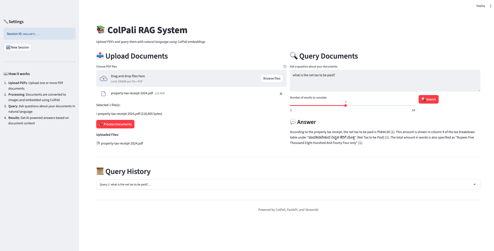

# 📚 ColPali RAG System

A **vision-first RAG (Retrieval-Augmented Generation)** system that leverages ColPali embeddings for multimodal document understanding. Unlike traditional RAG systems that extract text, this system preserves visual layout, charts, diagrams, and spatial relationships by working directly with document images.



## 🌟 Features

- **Vision-First Approach**: Processes PDFs as images, preserving layout and visual elements
- **ColPali Embeddings**: Uses ColQwen2 for sophisticated vision-based document understanding
- **Multimodal Understanding**: Handles text, charts, diagrams, tables, and complex layouts
- **Session Isolation**: Multiple users can work simultaneously with isolated document collections
- **Streaming Responses**: Real-time answer generation with progressive display
- **Modern UI**: Beautiful Streamlit frontend with intuitive file upload and querying

## 🏗️ Architecture

```
PDF Upload → Images → ColPali Encoder → Vector DB (Qdrant) → Similarity Search
                ↓                                                    ↓
         Supabase Storage ← Image Storage                   Image Retrieval
                                                                    ↓
User Query → ColPali Query Encoder → Vector Search → Claude 3.5 → Answer
```

### Technology Stack

- **ColQwen2**: Vision encoder for documents and queries
- **Qdrant**: Vector database for similarity search
- **Supabase**: Storage for document page images
- **Claude 3.5 Sonnet**: Vision-language model for answer generation
- **FastAPI**: Backend REST API
- **Streamlit**: Interactive frontend UI

## 🚀 Quick Start

### Prerequisites

- Python 3.12+
- UV package manager
- Supabase account
- Qdrant Cloud account
- Anthropic API key

### Installation

1. **Clone the repository**
```bash
git clone <your-repo-url>
cd colpali-rag-app
```

2. **Install dependencies**
```bash
uv sync
```

3. **Set up environment variables**

Create a `.env` file:

```env
# Vector Database
QDRANT_URL=your_qdrant_cluster_url
QDRANT_API_KEY=your_qdrant_api_key
COLLECTION_NAME=colpali_exploration

# Storage
SUPABASE_URL=your_supabase_project_url
SUPABASE_KEY=your_supabase_service_role_key

# AI Model
ANTHROPIC_API_KEY=your_anthropic_api_key
```

4. **Create Qdrant collection**
```bash
make create_collection
```

5. **Run the application**
```bash
python run_app.py
```

## 🖥️ Usage

1. **Access the application**: Open http://localhost:8501
2. **Upload PDFs**: Drag and drop PDF documents
3. **Process Documents**: Click "Process Documents" and wait for completion
4. **Ask Questions**: Type natural language questions about your documents
5. **Get Answers**: Receive AI-generated responses with page citations

## 📋 Available Commands

```bash
# Development
make dev          # Run FastAPI backend with hot-reload
make frontend     # Run Streamlit frontend
python run_app.py # Run both backend and frontend

# Code Quality
make lint         # Lint code with ruff
make format       # Format code with ruff
make mypy         # Type checking
make pretty       # Run all code quality tools

# Database
make create_collection  # Create Qdrant collection
```

## 🔍 How It Works

### Document Ingestion

1. **PDF to Images**: PDFs converted to high-resolution JPEG images (300 DPI)
2. **Vision Encoding**: ColQwen2 processes each page image into embeddings
3. **Storage**: Embeddings stored in Qdrant, images stored in Supabase
4. **Metadata**: Session ID, document name, and page number tracked

### Query Processing

1. **Query Encoding**: User question encoded using ColQwen2
2. **Similarity Search**: Vector search in Qdrant finds relevant pages
3. **Image Retrieval**: Original page images downloaded from Supabase
4. **Answer Generation**: Claude 3.5 Sonnet analyzes images and generates response

## 🚧 Project Structure

```
colpali-rag-app/
├── src/app/
│   ├── api/           # FastAPI routes and dependencies
│   ├── colpali/       # ColPali model loaders
│   ├── models/        # Pydantic models
│   ├── services/      # Business logic (upload/download)
│   └── utils/         # Utilities
├── scripts/           # Management scripts
├── prompts/           # LLM prompts
├── frontend.py        # Streamlit frontend
├── server.py          # FastAPI server
└── run_app.py         # Application launcher
```

## 🙏 Acknowledgments

- [ColPali](https://github.com/illuin-tech/colpali) for the vision-based document understanding
- [Qdrant](https://qdrant.tech/) for vector search capabilities
- [Supabase](https://supabase.com/) for storage infrastructure
- [Anthropic](https://www.anthropic.com/) for Claude 3.5 Sonnet
